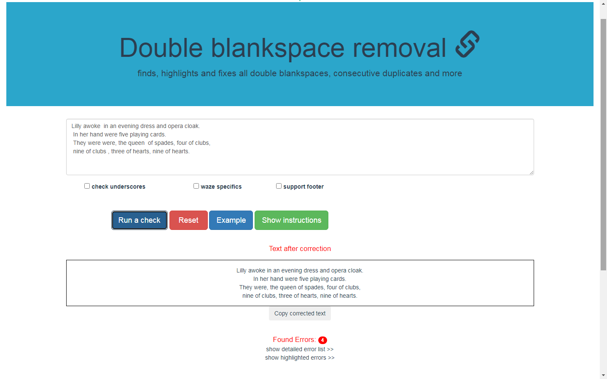
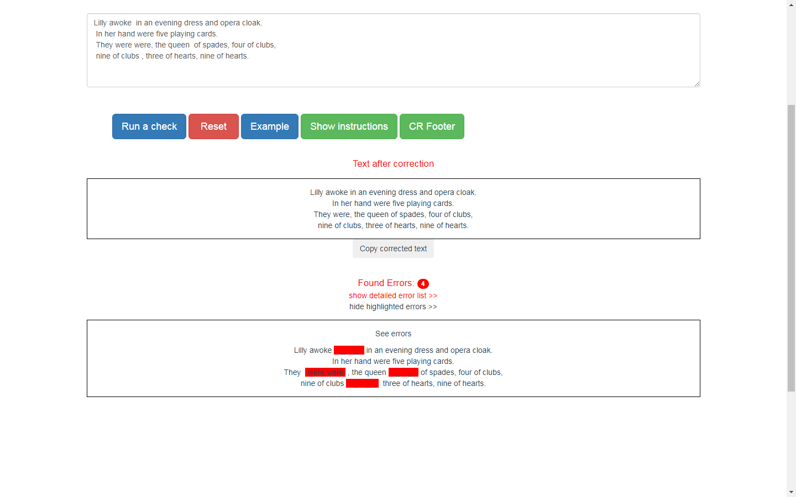
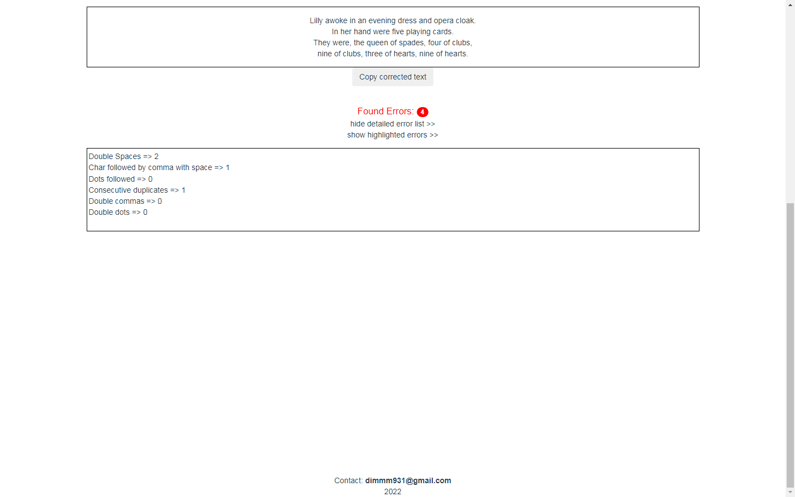
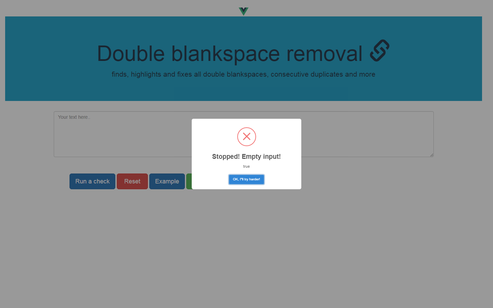
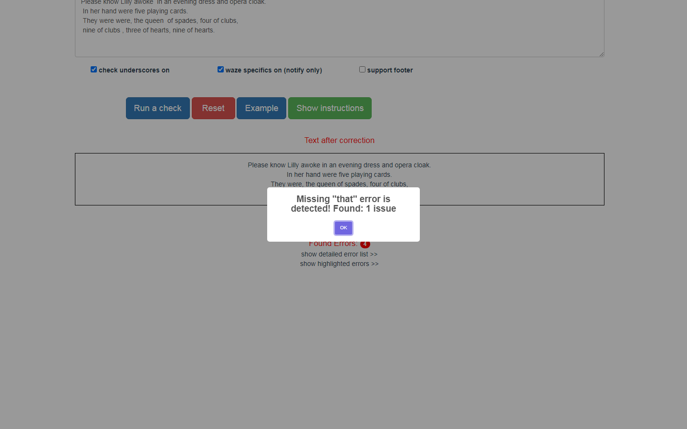
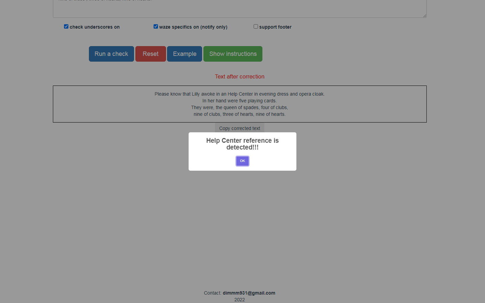
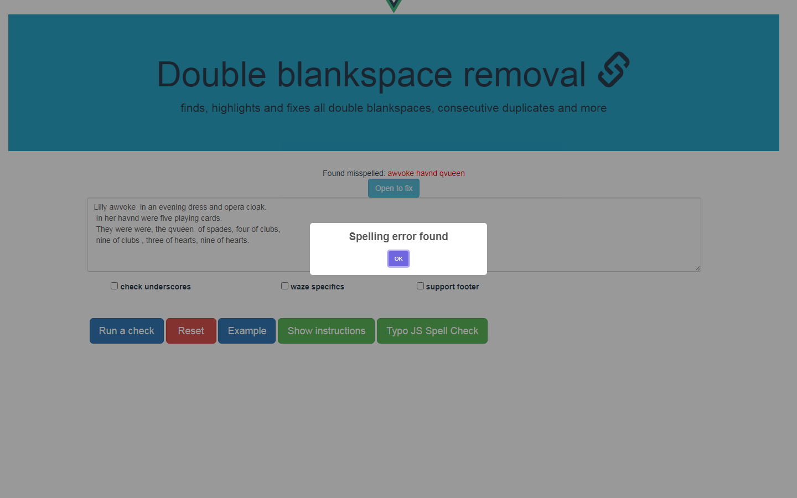
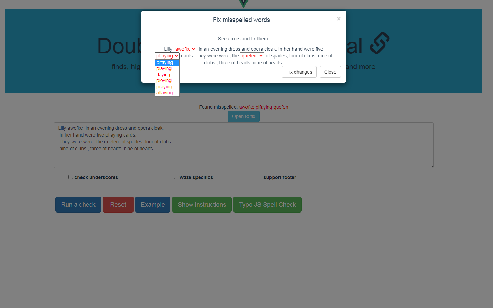
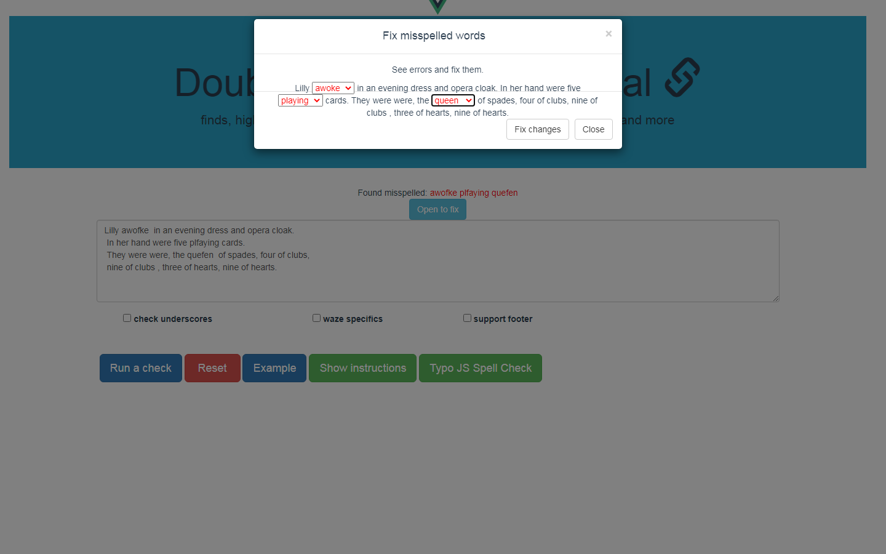
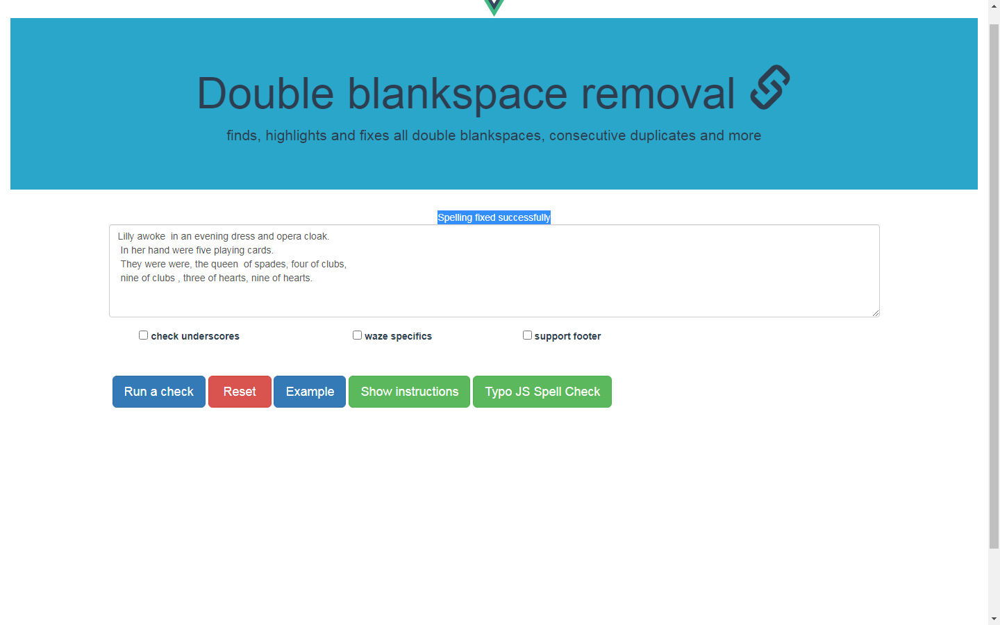

# Blankspace_remover_vue

> 99% the same as Cleansed version (Cleansed version contains less comments + ReadMe.md reduced up to 40%)

> Text editing tool on Vue Framework. Additionally uses Typo-JS Library for spell check (https://github.com/cfinke/Typo.js) + Element-UI Library (Impoted but Not used as a matter of fact).
> check


## Blankspace remover tool on Vue Framework.

- <p> The application checks text for commom punctuantion errors; it performs a check, finds, highlights and fixes all double blankspaces, blankspace + comma, blankspace + full stop. </p>
- <p> Additionally, it fixes consecutive duplicates, double commas, double dots, cases when word is preceeded by comma without no space and more, see full list below.</p>
- <p> Spell check is also available on request (Typo-Js library)</p>
- <p> Ready build script can be found at /dist </p>
- <p> Hot reload is availabe at http://localhost:8080/#/  on CLI -> npm run dev </p>


##  How to use Typo-js Library: 
- <p> Use `npm i typo-js` to install .</p>
- <p> In Vue case, copy Dictionary content files from /node_modules/typo-js/dictionaries to /static/dictionaries. For production Typo-JS Library Dictionary must be in the same root with index.html (in /dist) </p>
- <p> To init Typo-js object, specify the dictionary  folder path =>  `let dictionary = new Typo("en_US", false, false, { dictionaryPath: "/static/dictionaries" }); ` </p>
- <p> To check if a word spelled correctly       =>  `let is_spelled_correctly = dictionary.check(currWord);  //return true/false ` </p>
- <p> To get array of suggestions for misspelled => `let array_of_suggestions = dictionary.suggest(currWordPurified); `
- <p> NB: Typo-Js provides only basic scaffolding like checking if a single word is misspelled (true/false) and geting array of suggestions for misspelled. Particular realization up to you. </p>


## Brief overview of the application


## On click the app corrects the text fixing found errors





## Detailed list of found errors



## Input check



## Checking for some specifics (if you tick the checkbox)




## Checking for misspelled words by Typo-JS Library





## Build Setup

``` bash
# install dependencies
npm install

# serve with hot reload at localhost:8080
npm run dev

# build for production with minification
npm run build

# build for production and view the bundle analyzer report
npm run build --report

# run unit tests
npm run unit

# run all tests
npm test
```

For a detailed explanation on how things work, check out the [guide](http://vuejs-templates.github.io/webpack/) and [docs for vue-loader](http://vuejs.github.io/vue-loader).
