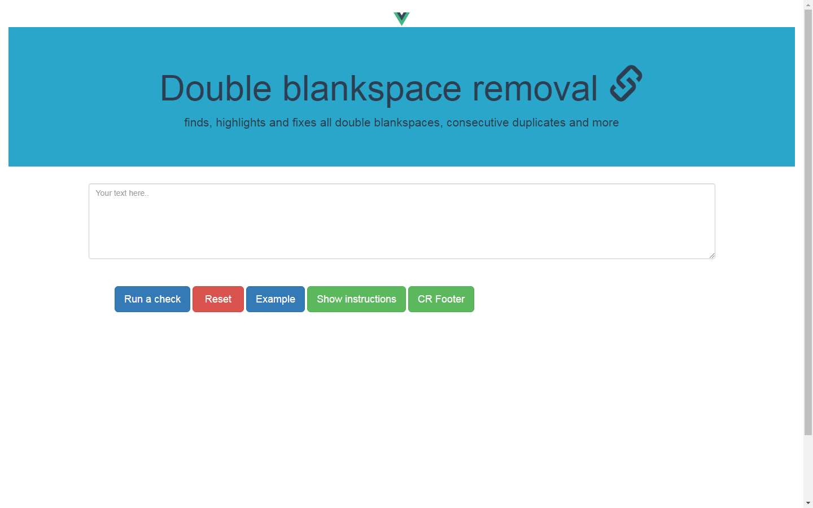

# Blankspace_vue_2022

> Blankspace rework on Vue Framework

## Blankspace remover tool on Vue Framework.

- <p>
    The application tool to check text for commom punctuantion errors; performs a check, finds, highlights and fixes all double blankspaces, blankspace + comma, blankspace + full stop.
    </br></br>Additionally, it fixes consecutive duplicates, double commas, double dots, cases when word is preceeded by comma without no space and more, see full list below.
 </p>

- <p> Availabe at http://localhost:8080/#/  on CLI -> npm run dev </p>

## Brief overview of the application




## Build Setup

``` bash
# install dependencies
npm install

# serve with hot reload at localhost:8080
npm run dev

# build for production with minification
npm run build

# build for production and view the bundle analyzer report
npm run build --report

# run unit tests
npm run unit

# run all tests
npm test
```

For a detailed explanation on how things work, check out the [guide](http://vuejs-templates.github.io/webpack/) and [docs for vue-loader](http://vuejs.github.io/vue-loader).
